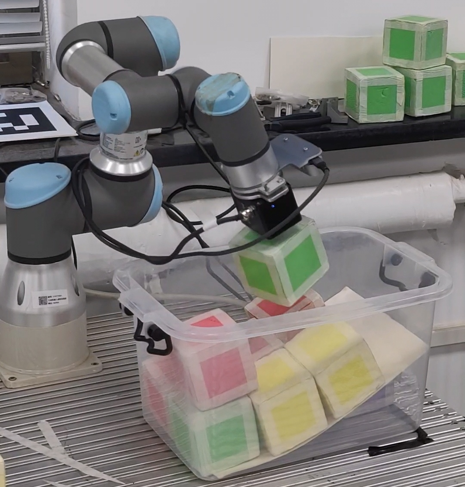
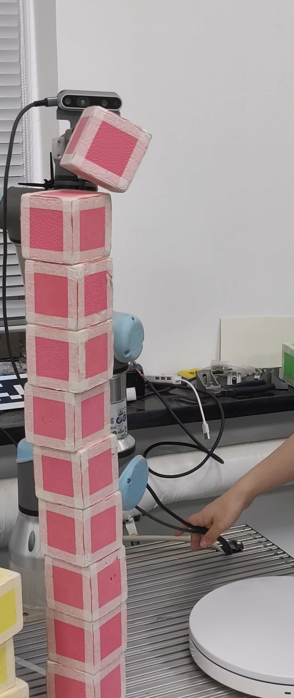

# Vision-guided pick and place with a UR arm

A ROS 2 package that drives a UR arm with a wrist-mounted RealSense camera and a suction cup through a two-stage, five-minute timed competition:

- Task 1: pick green, red and yellow blocks out of a bin and stack nine of them into three piles by colour.
- Task 2: pick red blocks off a rotating turntable and keep stacking them into one column.

Course project for *Interdisciplinary Project Training: Robot Intelligent Manipulation* (Spring 2026), done by [Zuo Gou](https://github.com/tactino) (苟左) and [Jiajie Zhang](https://github.com/z007-jj) (张家杰). Instructor: Xiang Li (李翔).

<p>
  
  
</p>

Demo videos (audio removed): [Task 1](demo/task1_demo.mp4) · [Task 2, stacking to 10](demo/task2_demo.mp4)

Full report (Chinese, 20 pages): [report/report.pdf](report/report.pdf) · [中文 README](README.zh-CN.md)

## Results

In the official run, Task 1 sorted and stacked all nine blocks, for 9 of 16 points. One yellow block had a dent that kept the suction cup from sealing. It took six tries, the last after flipping the block over with the TA's permission, and that cost about two minutes, so Task 2 never got started.

After the competition we tested Task 2 on its own. It picked blocks off the spinning turntable and stacked ten red blocks in one column. Ten is the cap we set in `stack_max_level`, because of arm reach and stack stability.

## How it works

Task 1 (`scripts/pick_and_place.py`), static blocks:

1. Gaussian blur, HSV conversion, CLAHE on brightness, then per-colour thresholds with an adaptive S/V relaxation.
2. Connected components, filtered by rectangularity and convex-quadrilateral shape, give each block's centre.
3. Back-project the depth pixels through the pinhole model and fit the top-face normal with SVD to get a 3D pose.
4. Accept a target only after 3 consecutive frames agree within 8 mm and 12°.
5. Approach, descend in slowing stages, lift. The tool yaw is matched to the block, and after each placement the camera checks the stack.

Task 2 (`scripts/pick_and_place_moving.py`), blocks on a turntable:

1. From an observation pose, sample the block's xy position and yaw every 50 ms for about 7 to 8 s.
2. Least-squares circle fit for the centre and radius, then a linear fit on the unwrapped phase for the angular speed.
3. Predict where the block will be after the move time plus descent time plus a margin, and go there.
4. At the approach pose, correct the centre and the edge-based yaw from a fresh image (this also resolves the π ambiguity in yaw).
5. Rotate and descend in three stages, switch on suction, place on the stack, return to the observation pose.

The launch file starts Task 1, waits for it to exit, and starts Task 2 five seconds later.

## Hardware

| Part | Details |
|------|---------|
| Arm | Universal Robots UR series over RTDE (default IP `192.168.56.3`) |
| Camera | Intel RealSense D series, wrist-mounted (eye-in-hand), hand-eye calibrated |
| Suction cup | Modbus over serial, `/dev/ttyUSB0` |

The home, observation and placement poses in `launch/pick_and_place.launch.py` were taught for our lab bench and calibration. On a different setup they need to be re-taught.

## Build and run

ROS 2 dependencies (declared in `package.xml`): `rclpy`, `sensor_msgs`, `cv_bridge`, `message_filters`, `tf2_ros`.

```bash
pip install opencv-python numpy scipy pyserial ur-rtde
pip install pyrealsense2   # optional, the camera is driven through ROS

cd ~/ros2_ws/src
git clone https://github.com/tactino/robot-manipulation-pick-and-place.git pick_and_place_task
cd ~/ros2_ws
colcon build --packages-select pick_and_place_task
source install/setup.bash
```

Both tasks in sequence:

```bash
ros2 launch pick_and_place_task pick_and_place.launch.py
```

Task 1 only:

```bash
ros2 run pick_and_place_task pick_and_place.py
```

Task 2 only (`--initial-stack-level` is how many blocks are already on the stack):

```bash
python3 install/lib/pick_and_place_task/pick_and_place_moving.py \
    --initial-stack-level 3 \
    --ros-args -p base_frame:=base
```

## Launch parameters

All have defaults and can be overridden on the command line, for example:

```bash
ros2 launch pick_and_place_task pick_and_place.launch.py \
    task1_approach_offset:=0.13 \
    task1_color_adaptive_sv_relax:=30
```

Task 1:

| Parameter | Default | Meaning |
|-----------|---------|---------|
| `task1_approach_offset` | `0.13` | Approach pose offset from the target (m) |
| `task1_grasp_offset` | `0.045` | Grasp pose offset from the target (m) |
| `task1_grasp_descent_offset` | `0.10` | Extra descent below the approach pose (m) |
| `task1_approach_to_grasp_end_speed_scale` | `0.40` | Final-stage speed, relative to nominal |
| `task1_approach_to_grasp_slowdown_stages` | `4` | Number of slowing stages on the way down |
| `task1_color_adaptive_sv_relax` | `25` | Adaptive relaxation of the HSV S/V thresholds |
| `task1_pick_camera_z_compensation_m` | `0.0` | Camera z bias correction (m) |
| `task1_initial_green_count` | `0` | Green blocks already placed |
| `task1_initial_red_count` | `0` | Red blocks already placed |
| `task1_initial_yellow_count` | `0` | Yellow blocks already placed |

Task 2:

| Parameter | Default | Meaning |
|-----------|---------|---------|
| `task2_approach_offset` | `0.10` | Approach pose offset (m) |
| `task2_grasp_offset` | `0.05` | Grasp pose offset (m) |
| `task2_pick_camera_z_compensation_m` | `0.01` | Camera z bias correction (m) |

Poses (`home_pose`, `place_pose_*` and so on) are written as `[x, y, z, qx, qy, qz, qw]` and converted to RTDE rotation vectors at start-up. With `apply_pose_frame_transform: true` (the default) they are rotated 180° about z to match the hand-eye calibration frame.

## Debug tools

| Script | What it does |
|--------|--------------|
| `scripts/color_threshold_tuner.py` | Tune the HSV thresholds live and check the segmentation |
| `scripts/pick_pose_debug.py` | Visualise the planned approach and grasp poses |
| `scripts/pose_camera_monitor.py` | Watch the camera pose and TF transforms |

The main nodes also take `show_debug_window:=true` to open an OpenCV debug window.

## Layout

```
├── scripts/
│   ├── pick_and_place.py          # Task 1 node
│   ├── pick_and_place_moving.py   # Task 2 node
│   ├── color_threshold_tuner.py
│   ├── pick_pose_debug.py
│   └── pose_camera_monitor.py
├── launch/
│   └── pick_and_place.launch.py   # runs Task 1, then Task 2
├── demo/                          # demo videos
├── report/                        # LaTeX source, figures and PDF of the report
├── CMakeLists.txt
└── package.xml
```

## License

MIT, see [LICENSE](LICENSE).
